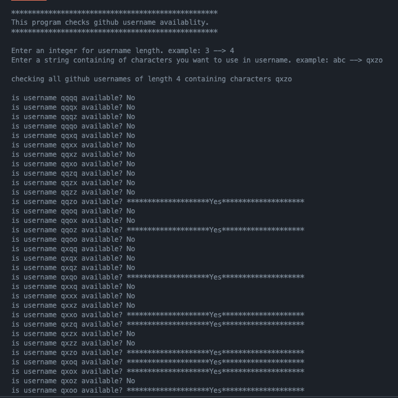

# 🔎   Searching Available Github Usernames Automatically 

This python program automatically searches available github usernames given the username length and characters.

<br>

For example, passing in username length of 3 and characters of **"abc"**, the program will check the availablity of the following usernames:

```
aaa
aab
aac
aba
abb
abc
aca
acb
acc
baa
bab
bac
bba
bbb
bbc
bca
bcb
bcc
caa
cab
cac
cba
cbb
cbc
cca
ccb
ccc
```

<br>

## Setup & Usage
Install python **requests** library:

```bash
pip install requests
```

Running the program:
```bash
python3 search_github_username.py
```



<br>
**NOTE**: some "reserved" usernames are marked as available but you cannot create account under those names. Example of such names are **api**, **new**, **get** and more